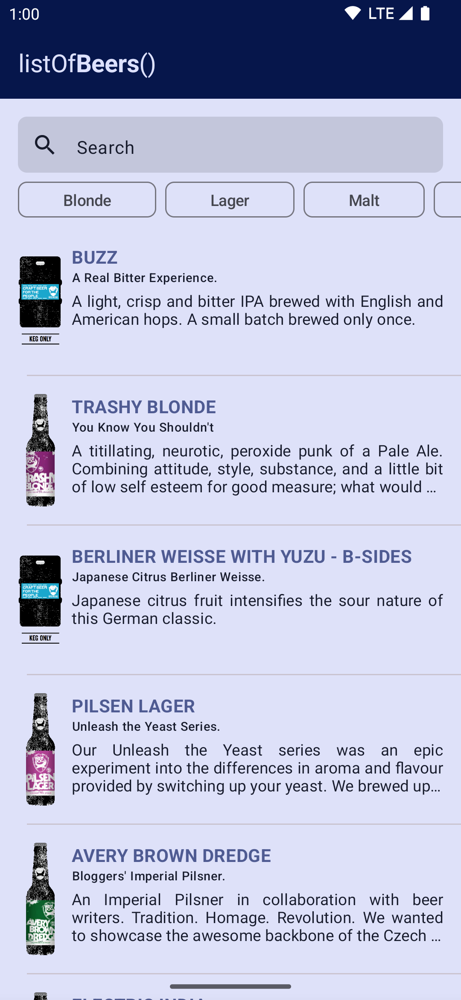
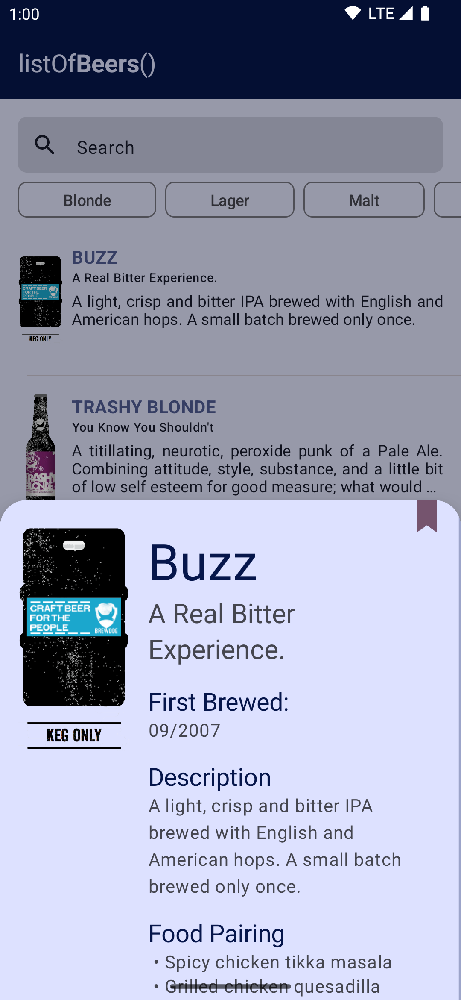

# listOfArts()

A simple demo app for playing and testing latest Android libraries

## 👁️Previews

## 🛠 Tech
- 100% Kotlin
- Jetpack Compose
- Material 3 Compose
- MVVM
- Hilt
- Coroutines
- Retrofit
- Timber
- Coil
- Accompanist
- kotlinx.serialization
- MockWebServer (tests)
- Turbine (tests)
- ktlint
- Detekt (with Twitter Compose rules)

## ✅ Available Features
- Online beer search via text
- Beer filtering by keyword
- Light and Dark mode support
- Portrait and Landscape support
- Material You dynamic color support (Android 12+)
- Themed/Monochrome Icons (Android 12+)
- Predictive Back Gesture (Android 13+)
- Unit tests
- Instrumentation tests

## ☑️TODO
- [ ] Add instrumentation tests to Github Checks
- [ ] Add local cache with Room
